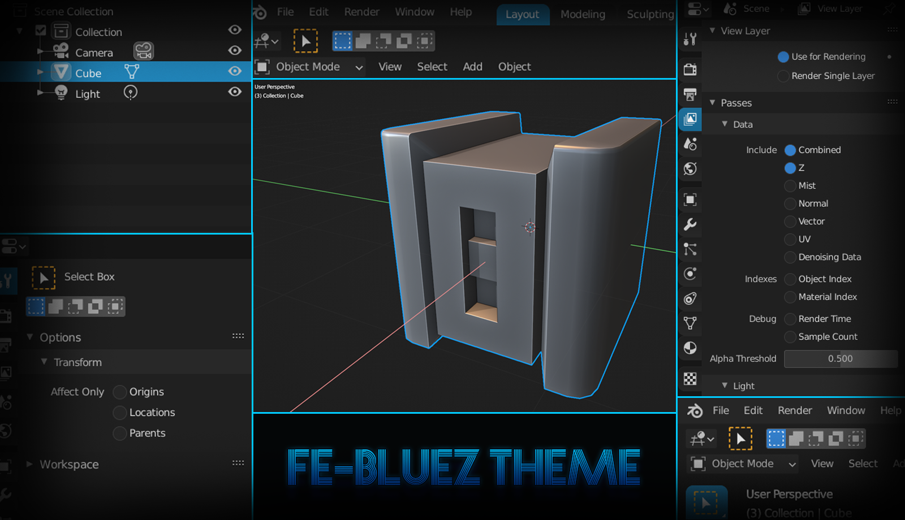
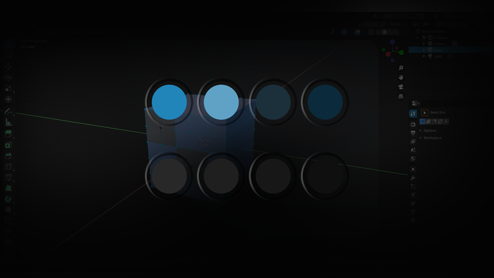

# FE-BLUEZ Theme for blender 2.8 and above

This is Fe-Bluez. A new blue concept styled theme for blender. This theme is currently in progress and I can't tell when I will post the updates. There are a few UI itens that are still in default style.

Enjoy it.

## Installation

1. Download the **<kbd>.xml</kbd>** file.

2. Go to **_blender > Edit > Preferences_**

3. Inside the tab **_themes_** click on the install button

4. Locate and select the **<kbd>.xml</kbd>** file.